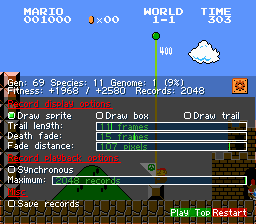
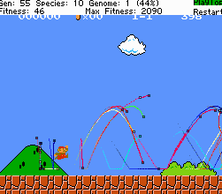
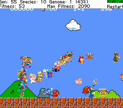

# MarI/O FCEUX Replay Edition
When one mario isnt enough


## Why does this fork exist?
It is quite boring to watch how original algorithm takes infinite amount of same looking trials and errors over and over again. So currently this fork aimed to create enhanced visuals, so watching at learning progress can be more entertaining.

## Features
- Records last unique X amount of retries (can be configured in .lua file)
- Displays all of them on screen simultaneously
- Two record display modes
- Uses sprites from Super Mario Maker for replay visualization (160 characters total)
- Can export replays to use with custom software

## Instructions
1. Save neatevolve.lua somewhere on your computer.
2. Open Super Mario Bros. in FCEUX.
3. Go to some level and make a savestate at the beginning of the level. Use savestate slot 1 or edit the settings in the script.
4. Load the script in FCEUX (File -> Load Lua Script)
5. Enjoy!

If you start FCEUX from the terminal you'll get some usefull debug info.

Tested on FCEUX 2.2.2 (Ubuntu 16.04). 

## Configuration
Script have useful GUI which helps to modify settings in real time
Click on the box on the bottom left corner, to open options menu

<kbd></kbd>

Theese settings currently isnt stored, so if you want to modify default settings, you should edit .lua script directly

```
DrawRecordAsBox = true -- draws record using simple colored box during playback
DrawRecordTrail = true -- draws record trajectory trail during playback
```
<kbd></kbd>
```
DrawRecordAsSprite = true -- draws record using character sprite during playback
```
<kbd></kbd>
```
MaxRecords = 1024               - maximum amount of simultaneously played records
                                  when this number is exceeded, oldest record
                                  will be removed
SynchronizedPlayback = false    - Should replays wait for current iteration to finish
                                  if set to true, every replay will start for beginning
                                  when new iteration is run. Useful when you want race-like replays
                                  but it can be very crowded in the beginning.
                                  if set to false, every replay plays itself independent
                                  of others on infinite loop, so all replays redistributed
                                  on level move evenly

SaveGenerationRecords = true    - saves all unique records for each generation in backup directory
                                  so you can import it in your custom programm, if you like
                                  file format is pretty simple and can be viewed in .lua file
RecordTrailFrameCount = 30      - trail length in frames
DissolveAnimationFrames = 15    - fade out animation duration in frames
PlayerCloseFadeDistance = 32    - objects will start to fade at this distance to player, 
                                  so player can be seen through in very crowded environment. 0 to disable
PlayerCloseMaxFade = 0.1        - maximum fade amount, so record still can be visible, 
                                  even if its on same spot as player (0: fully transparent, 1: fully opaque)
```

### Loading a previous generation
Backups of every generation will be saved in a folder called 'backups'. If you wish to load or continue from a backup, edit the settings in the script, e.g.
```
LOAD_FROM_FILE = "backups/backup.5.SMB1-1.state.pool"
```
Value 'nil' will start a new pool.
```
LOAD_FROM_FILE = nil
```
### HUD elements
You can toggle the HUD elements ON/OFF by clicking on them. Turning HUD elements (and sound) off will greatly improve performance on fast emulation speeds. There's no external gui like in BizHawk since FCEUX's lua support is more limited.

## Changes from SethBling's original script
Mostly just some gui/HUD stuff that wasn't supported in FCEUX. Otherwise it's quite vanilla. Super Mario World references were removed since FCEUX is NES only. If you know a SNES emulator that runs on linux and supports lua scripting let me know, I'd love to get this working for SMW!

## TODO
- Sprites for big mario
- Probably script which allow to playback these replays during normal gameplay

## Credits:
- MarI/O: SethBling
- FCEUX Port: juvester
- Super Mario Maker Sprites: Random Talking Bush
